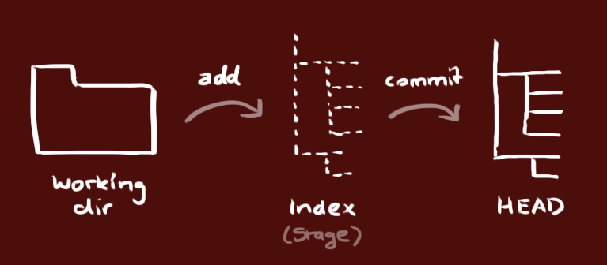

# How to use GIT <Basic>

[Reference](https://rogerdudler.github.io/git-guide/index.ko.html )


1. 새로운 저장소 

   ~~~
   git init
   ~~~

   폴더를 만든후 안에서 명령을 실행하면 새로운 저장소 생성


2. 

   git 에는 3가지 종류의 가지가 있음 working dir(실제 작업 디렉토리), Index dir(준비영역) , HEAD(최종확정하는 Commit) 종류가 있음 


3.  working Directory 를 온라인저장소와 연결 시켜줘야함

   ```
   git remote add origin 주소/Username/name of file # ex) https://github.com/sunghowoo/testing1.git/
   ```
   만약 origin이라는 원격 저장소를 지우고 싶다면 git remote remove origin하면 됩니다. 그후 다시 새로운 이름으로 저장


3.  working directory 만든 파일을 각각 인덱스에 추가하하며

   ``` 
   git add <파일 이름> # specific 한 추가
   git add * # 모든 파일들은 index 로 추가하는것이라 추천하지 않는다고함
   ```


4. commit 을 해줘야지 head 영역으로 가줌, 단 아직까지 온라인 저장소로는 가지않음

   ```
   git commit -m "여기다가 변경된 내용을 적어줘서 나중에 수정하기 편하게"
   ```


5. 이제 push 를 통하여 온라인 저장소로 밀어버림

   ```
   git push origin master 
   ```

   

-------------------------------------------

### Branch 방법( BY 건희)

\- git 을 이용한 Branch 사용법( beta version 으로 테스트 가능) .git 이 없으면 싸이트에서 업데이트 된걸 불러올수없어

- $git fetch = 현재 깃헙에 있는것 업데이트

- $git branch$git checkout develop = branch안에있는 develop 버젼을 불러올수있음 바로 develop버전으로 바뀌어서 빠르게 버젼체인지 가능

- Cm 해줘야함 새로운거니까

### pull 방법

- 온라인 저장소에 추가된것을 업데이트 받고싶다면

  ~~~
  git pull origin master  #master branch 에서 연결되어있는 Working directory 로 업데이트해준다.
  ~~~

  

